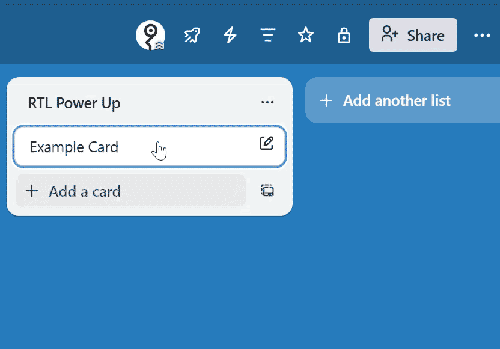
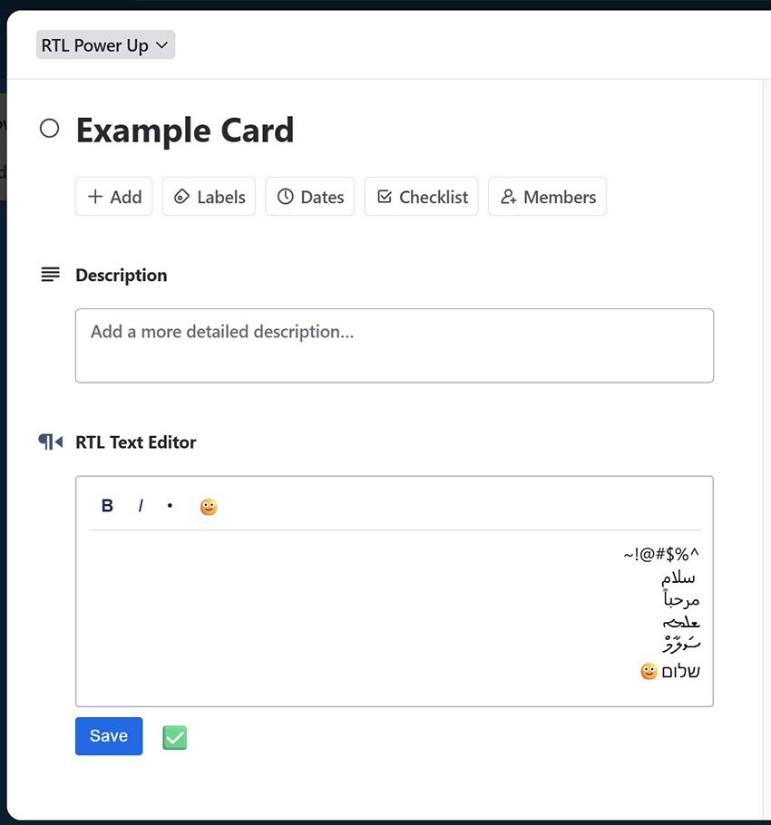

# trello-rtl-powerup

#### RTL support for Trello:

> add a right-to-left text editor to each of your Trello cards (browser only).


## Installation

1. go to > https://trello.com/power-ups/admin
2. New > New Power-Up or Integration name > `RTL Power-Up`
3. Workspace > Pick your workspace 
4. Email / Support / Author > as you like
5. iFrame connector URL > `https://rotem-abir.github.io/trello-rtl-powerup/public`
6. Create
7. Icon > `https://rotem-abir.github.io/trello-rtl-powerup/public/rtl-icon.png` > Save
8. Capabilities > turn on:
    * Board buttons
    * Card back section
    * Card buttons
9. Go to your desired board
10. click "Power-Ups" (rocket icon on the top right) > Add Power-Ups
11. Custom > RTL Power-Up > Add > Add
12. Congratulations!

<br>



## How to use

(A) Once the power up is installed, a new section "RTL Text Editor" will automatically be added to every card on the board.

(B) Click "Edit" and add your Right-to-Left text

(C) In editing mode, clicking the red "X" cancel text edits

(D) Green "V" indicates no changes




## Current Limitations

1. The power-up is working only on the browser (desktop and mobile).
2. No native app support but: on the app you can't see your RTL texts, yet they didn't disappear! they are still there, but visible/editable only via browser.
3. The editor is still plan - hopefully be upgraded to rich text in the future. ***FIXED. will appear in next release v0.1.1***

## Your Data

1. The power up does not have access to your data.
2. It saves a key-value in Trello’s Power-Up data (pluginData) store
3. If you disable the power up, you can still keep the power up data
4. Once you enable the power up, your data will appear on your cards
5. There is no liability for your stored data, as the power up is working properly at the time of writing this.


## Development

### Server

1. Create OpenSSL (self-signed) key + certificate:
```
bash

MSYS2_ARG_CONV_EXCL='*' openssl req -x509 -newkey rsa:2048 -sha256 -days 365 -nodes \
  -keyout key.pem -out cert.pem \
  -subj "/CN=localhost" \
  -addext "subjectAltName=DNS:localhost,IP:127.0.0.1"
```

2. Add `cert.pem` and `key.pem` to `/server`
3. to run the server, open bash inside `/server` and type: `node server.js`
4. go to > https://trello.com/power-ups/admin > "RTL Power-Up"
5. change Iframe connector URL to: `https://127.0.0.1` > Save
6. Now the power up loads itself from your local server


<br>

---

<br>

thanks for reading,

##### MrYelloX